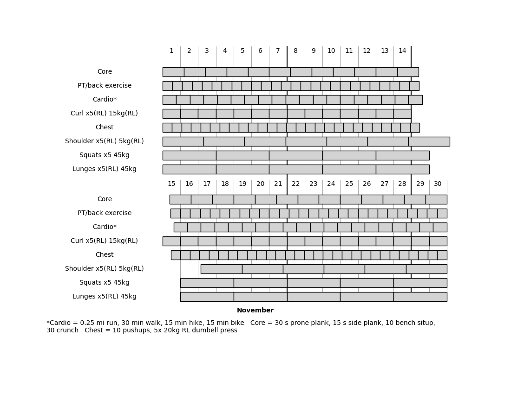

# Simple Python Workout Chart
Generate a printable monthly workout chart so you can check off boxes to mark your progress.

## Concept
This program creates PDFs of your workout chart. The information to build a workout chart is stored in .yaml files.

Each workout goal has 3 elements: name, boxes, and days. The boxes represent whatever you want to be a unit of working out. 20 pushups could earn checking off one box. The days sets the rate of # of boxes / # of days. The Boxes/Days rate will be scaled to the length of the entire month. E.g., if you want to do pushups 10 times every 7 days, there would be 40 boxes in February.

## Use
The main Python script is ```workoutChartMPLOO.py```
Install all of the dependencies (ideally in a virtual environment) and run this script.
The command ```python workoutChartMPLOO.py --demo``` will run a quick demo to test that the software is working.

The default folders are ```saved_charts``` saved PDF charts, and ```saved_configs``` for YAML chart information files. Use these folders for the most consistent results.

The chart can visually support up to 8 different workout types. Beyond this, you would have to start tinkering with other settings such shrinking ```self.rowHeight``` to squeeze more in. (next TODO is to make this more automatic)

You can make your chart one of 3 ways:
* GUI (recommended)
* Direct YAML editing and CLI
* Hardcoding


### GUI mode
Simply run ```python workoutChartMPLOO.py``` with no arguments. The GUI will allow you to create new files and load, edit, preview, and save charts.

### Hardcoding
The monthly goals are defined in the ```workoutList``` variable in the ```run_hardcoded()``` function. This is a list of lists. Each inner list is a workout type and goal. An inner list is defined using 3 elements, in order: [Name, Boxes, Time Period (days)]. 

You can add a note with more information to the chart by changing ```note```.

Set the month in ```month```, making sure to use the MonthName Enum, e.g. ```MonthName.FEBRUARY29```, or ```MonthName.AUGUST```

Set the save file name in ```output_name```.

Run the script in your IDE or from the command line.

### CLI
Using the command line interface, you specify the input (YAML) and output (PDF) files, relative to the base directory. E.g. ```python workoutChartMPLOO.py --input_file saved_configs/demo.yaml --output_file saved_charts/CLIdemo.pdf```. You can access this information with ```python workoutChartMPLOO.py --help```.

Using the ```--demo``` argument will run a demo mode and ignore all other arguments.

Running with no arguments will open the GUI mode.

## Working Out
Decide what counts for a box, and check off boxes as you go.

I like to make 10 pushups a "chest" box, 15 mins of hiking or 0.25 mi jogging a "cardio" box, 30 crunches a "core" box, etc.

As you check off boxes, the chart will show if you are ahead or behind your goal pace for the month. Try to complete all boxes by the end of the month!

Keep the requirements for a box consistent, and add more boxes over time to increase your workouts. You can do this by raising the number of boxes or lowering the number of days.

## Example
Here is a generated PDF for November:

Here is an (almost) complete printed chart from October. I like to write down the date inside a box as I check it off, but a simple X will work just fine.

