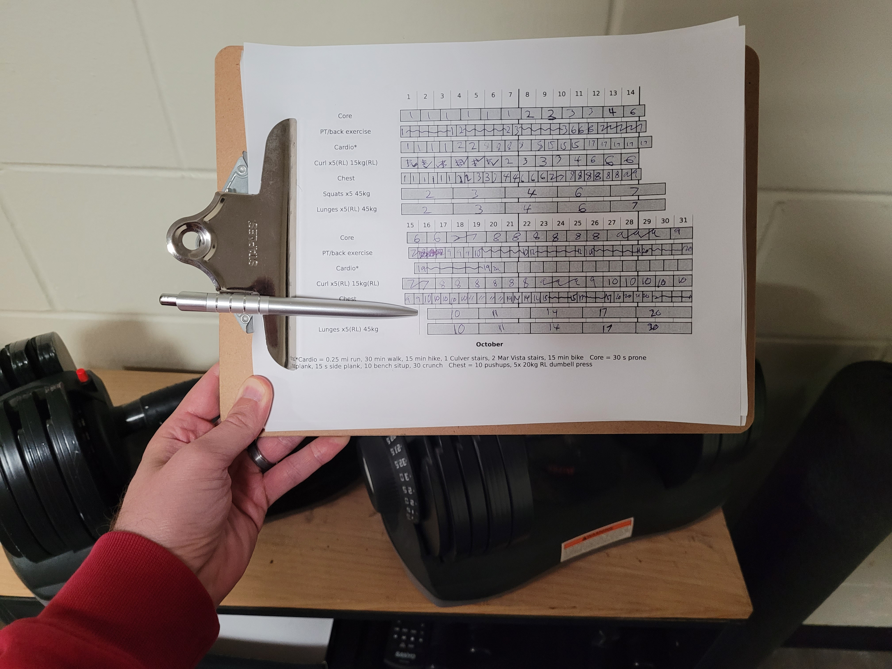

# Simple Python Workout Chart
Generate a printable monthly workout chart so you can check off boxes to mark your progress.
## Use
Right now, most of the usage involves making hard-coded changes. This will change in the future. This requires familiarity with Python.
### Add Goals
The monthly goals are defined in the ```workoutList``` variable in the ```main``` function. This is a list of lists. Each inner list is a workout type and goal. An inner list is defined using 3 elements, in order: [Name, Boxes, Time Period (days)]. E.g., if you want to do pushups 10 times every 7 days, the list would be ```['Pushups', 10, 7]```. The Boxes/Time Period rate will be scaled to the length of the entire month, so there would be 40 boxes in February in this example. These boxes represent whatever you want to be a unit of working out. 20 pushups could earn checking off one box.

You can add a note with more information to the chart by changing ```self.note```.

The chart can visually support up to 8 different workout types. Beyond this, you would have to start tinkering with other settings such as ```self.rowHeight``` to squeeze more in.
### Run
Since each month is a different length, change the name of the month in the ```if __name__ == "__main__":``` code block to the current month. Use "February (28)" or "February (29)" to specify the length of February.

Run the program. You will see a preview in TKinter. Close the preview. A PDF will automatically be saved in the same folder as the Python script. Open and print the PDF.
## Working Out
Decide what counts for a box, and check off boxes as you go.

I like to make 10 pushups a "chest" box, 15 mins of hiking or 0.25 mi jogging a "cardio" box, 30 crunches a "core" box, etc.

As you check off boxes, the chart will show if you are ahead or behind your goal pace for the month. Try to complete all boxes by the end of the month!

Keep the requirements for a box consistent, and add more boxes over time to increase your workouts. You can do this by adjusting ```workoutList``` with a higher number of boxes or a shorter time period.

## Example
Here is a generated PDF for November:

Here is an (almost) complete printed chart from October.

